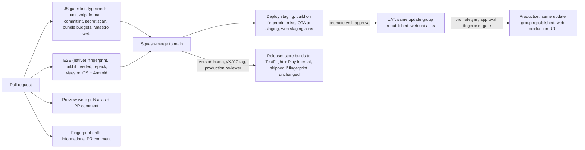

# Expo Boilerplate

[](https://github.com/seandillon1224/expo-boilerplate/actions/workflows/ci.yml)

An opinionated Expo template with the delivery pipeline already wired: a JS gate on GitHub Actions, native Maestro E2E and a staging → UAT → production release ladder on EAS Workflows, web on EAS Hosting with PR previews, performance tooling from dev to prod, and a self-deleting init script that turns the template into your app. Opinionated infra, thin product: the demo app is a home tab, a settings tab, an updates screen and one fetch screen. Bun only, Expo SDK 57, New Architecture and React Compiler on, CNG only (no committed `ios/` / `android/`).

Design and the locked decisions: `PLAN.md`. Working agreement for humans and agents: `CLAUDE.md`.

## What's inside

| Area         | What you get                                                                                                                                                                                                                                                                                                                                                            | Read                                                                                                                             |
| ------------ | ----------------------------------------------------------------------------------------------------------------------------------------------------------------------------------------------------------------------------------------------------------------------------------------------------------------------------------------------------------------------- | -------------------------------------------------------------------------------------------------------------------------------- |
| **App**      | Expo Router (typed routes), NativeWind v5 / Tailwind v4, TanStack Query (persisted), Zod-validated `EXPO_PUBLIC_*` env, i18next with typed keys, Sentry (errors only, off until a DSN is set), EAS Observe (`markInteractive` on every data screen), `expo-updates` behind a single `useUpdatePolicy` hook, shared loading / empty / error states and error boundaries. | [Environments and secrets](docs/environments-and-secrets.md), [EAS Observe](docs/observe.md)                                     |
| **Quality**  | ESLint 9 flat config (`eslint-config-expo` + import sort + unused imports + RN a11y + a `testID` rule on every pressable / input), Prettier, knip, commitlint (Conventional Commits) + PR-title check, Lefthook hooks, Jest + `jest-expo` + RNTL, gitleaks secret scan, Renovate.                                                                                       | [JS gate](docs/js-gate.md)                                                                                                       |
| **E2E**      | One Maestro workspace (`.maestro/`) with shared steps and thin web / native entries; web flows run in the JS gate against the static export, iOS + Android flows run on EAS Workflows from a fingerprint-matched build repacked with the PR's JS. Quarantine tag + flake budget.                                                                                        | [Native E2E](docs/native-e2e.md)                                                                                                 |
| **Delivery** | Four `APP_VARIANT`s (`development` / `staging` / `uat` / `production`) driving name, ids and scheme from one `app.config.ts`; EAS Build keyed by `@expo/fingerprint`; OTA to `staging` on every merge, approval-gated promotion of the same update group to `uat` and `production`; EAS Hosting on the same ladder; store release on a `vX.Y.Z` tag.                    | [Release ladder](docs/release-ladder.md), [Build sharing](docs/build-sharing.md), [Device onboarding](docs/device-onboarding.md) |
| **Perf**     | Rozenite DevTools in dev builds, Expo Atlas for bundle composition, per-platform gzip bundle budgets in CI, Reassure render-perf compare on every PR, EAS Observe TTI budget for a staging soak.                                                                                                                                                                        | [Performance](docs/performance.md)                                                                                               |
| **Template** | Toolchain `doctor` with install hints, `repo:settings` to push branch protection and merge settings, and an init script that rewrites every identifier, resets the ledger and removes itself, checked end to end in CI.                                                                                                                                                 | [Toolchain check](docs/doctor.md)                                                                                                |

## Quick start

Use this template on GitHub (or clone it), then:

```sh
bun install
bun run doctor # toolchain check with fix hints (Bun / Node / git required; EAS, gh, Maestro, Xcode, Android, Java per lane)
bun run init   # new app from the template: rewrites name / slug / ids, resets the ledger, removes itself (docs/template-init.md)
bun run ios    # or android / web
```

Then push to GitHub and run `bun run repo:settings:apply` once: it makes every JS-gate job a required check on `main` and sets squash-only merging with auto-merge for Renovate ([JS gate](docs/js-gate.md#how-merging-works)). Create the EAS project, channels and environments as described in [Environments and secrets](docs/environments-and-secrets.md); from there every merge to `main` lands on staging by itself.

First release: [Release ladder → Store release](docs/release-ladder.md#store-release-tag) (bump `version`, push a `vX.Y.Z` tag, approve the GitHub `production` Environment).

## The pipeline



Who runs what:

| System                                | Workflows                                                                                                                                                                                                                                                   |
| ------------------------------------- | ----------------------------------------------------------------------------------------------------------------------------------------------------------------------------------------------------------------------------------------------------------- |
| GitHub Actions (`.github/workflows/`) | `ci.yml` = the JS gate (required checks, plus informational `Perf (Reassure)` and `Fingerprint drift`); `pr-title.yml`; `release.yml` = the `production` Environment reviewer that dispatches the EAS store release on a `vX.Y.Z` tag                       |
| EAS Workflows (`.eas/workflows/`)     | `e2e.yml` (PR native check), `preview-web.yml` (PR web preview), `deploy-staging.yml` (push to `main`), `promote.yml` (manual, `require-approval`), `release.yml` (store builds + submit), `register-device.yml`, `observe-check.yml`, `e2e-quarantine.yml` |
| EAS Build / Update / Hosting          | Builds keyed by fingerprint (CI never runs Metro); channels `staging` / `uat` / `production` mirror the variants; web aliases `pr-N` / `staging` / `uat` and the production URL                                                                             |

Two rules hold on the ladder: what UAT signed off is byte-for-byte what production gets (promotions republish an update group, never re-bundle), and an update only reaches builds with the same native fingerprint. Details, rollback and hotfix: [Release ladder](docs/release-ladder.md).

## Commands

The most-used scripts; the full list with flags is in `CLAUDE.md`.

| Task       | Command                                                                                              |
| ---------- | ---------------------------------------------------------------------------------------------------- |
| Dev server | `bun run ios` / `bun run android` / `bun run web`                                                    |
| Local gate | `bun run lint && bun run typecheck && bun run test && bun run knip && bun run i18n:check`            |
| Env        | `bun run env:check`, `bun run env:pull` (`env:pull:preview` / `env:pull:production`)                 |
| E2E web    | `bun run export:web`, `bun run serve:web`, then `bun run e2e:web`                                    |
| E2E native | `bun run e2e:build` → `bun run e2e:repack` → `bun run e2e:ios` / `bun run e2e:android`               |
| Perf       | `bun run perf:baseline` then `bun run perf`; `bun run export:web && bun run budget`; `bun run atlas` |
| Release    | `bun run fingerprint`; `bun run eas workflow:run promote.yml -F target=uat`; push a `vX.Y.Z` tag     |
| Devices    | `bun run devices:add` / `bun run devices:list`                                                       |
| Template   | `bun run doctor`, `bun run repo:settings:apply` / `repo:settings:check`                              |

## Commonly added next

Deliberately not in the template (PLAN.md decision 5: no auth, backend or forms). Suggested starting points:

- **Auth** — Clerk or Supabase Auth (`expo-secure-store` for tokens); the `expo/examples` `with-clerk` / `with-supabase` projects are version-matched starting points.
- **Backend / API layer** — Expo Router API routes on EAS Hosting for a thin BFF, or a typed client (`openapi-fetch` / tRPC) wrapped in the existing TanStack Query setup.
- **Forms** — `react-hook-form` + the Zod already installed (`@hookform/resolvers`).
- **Push notifications** — `expo-notifications` with Expo push tokens; add the config plugin and an EAS credential per variant.
- **Deep links** — the `scheme` per variant is already in `app.config.ts`; add universal links / app links via `ios.associatedDomains` and `android.intentFilters`.
- **Analytics** — PostHog (`posthog-react-native`) or Segment; keep the key in EAS environment variables and read it through `@/lib/env`.
- **Storybook** — deliberately not included (PLAN.md decision 14); the demo screens plus RNTL and Reassure cover component work.
- **Release automation** — release-please for version / build-number bumps and changelog ([#60](https://github.com/seandillon1224/expo-boilerplate/issues/60)).
- **Multi-runtime OTA backports** — shipping OTA-safe fixes to older store runtimes ([#61](https://github.com/seandillon1224/expo-boilerplate/issues/61)).
- **Update policies** — forced / opt-in / silent updates and rollout % on top of `useUpdatePolicy` ([#62](https://github.com/seandillon1224/expo-boilerplate/issues/62)).
- **Flashlight** — Android performance scores in the native E2E lane ([#63](https://github.com/seandillon1224/expo-boilerplate/issues/63)).
- **oxlint** — a fast first pass in front of ESLint ([#64](https://github.com/seandillon1224/expo-boilerplate/issues/64)).
- **Accessibility E2E** — a Maestro flow with the screen reader on ([#65](https://github.com/seandillon1224/expo-boilerplate/issues/65)).
- **Maestro Cloud** — an optional device-farm job ([#66](https://github.com/seandillon1224/expo-boilerplate/issues/66)).

## Docs

- [Template init](docs/template-init.md) — `bun run init`: what it rewrites (app config, workflow envs, badges, docs), the steps (ledger + `PLAN.md` reset, self-delete, optional fresh git history), the flags, the headless form, and `bun run template:e2e`.
- [Toolchain check](docs/doctor.md) — `bun run doctor`: every tool the lanes need, the expected versions and why, install hints, `--strict` / `--json`.
- [CI overview](docs/ci-overview.md) — the map of both CI systems: every GitHub Actions job and EAS workflow, triggers, gates, repo constants (`HOSTING` / `IOS_MODE` / `IOS_BUILDS` / `IOS_RELEASE` / `PLAY_SUBMIT`), what each needs, and the "when something is red" triage table.
- [JS gate: required checks](docs/js-gate.md) — what gates merge, how merging works, running the gate locally.
- [Testing](docs/testing.md) — the pyramid as built: Jest + RNTL (async v14 rules, what `jest.setup.ts` mocks, mocking env / i18n / query), script tests, Reassure, Maestro web and native lanes, the template e2e, what runs locally vs CI, how to write one more of each.
- [Conventions](docs/conventions.md) — the house rules for humans: Bun-only, Conventional Commits and hooks, source layout and naming, `testID` / `t()` / `@/lib/env` / CNG / `APP_VARIANT` / `useUpdatePolicy` / states and error boundaries, docs conventions, how to change a locked decision.
- [Architecture decision records](docs/adr/README.md) — the locked decisions as ADR-0001, the template for the next one, status values.
- [Environments and secrets](docs/environments-and-secrets.md) — EAS build profiles (`eas.json`), EAS environment variables as the source of truth, `env:pull`, the Zod env schema, runtime version = fingerprint.
- [Native E2E (iOS / Android)](docs/native-e2e.md) — reproducing the EAS Workflows native lane locally: `bun run e2e:build`, `e2e:repack`, `e2e:ios` / `e2e:android`.
- [Release ladder](docs/release-ladder.md) — the runbook: PR previews → `main` → staging (automatic) → UAT → production (approval-gated promotions) → store release on a `vX.Y.Z` tag; channel / branch / variant mapping, rollback per channel (`eas update:rollback` / `update:republish` / roll-back-to-embedded), hotfix path.
- [Getting the staging app on your iPhone](docs/device-onboarding.md) — device registration for testers (plain language) and the engineer side (`bun run devices:add`, the `Register test device` workflow, rebuild after).
- [Build sharing](docs/build-sharing.md) — where install links come from (install page, Slack `slack` jobs, PR comments, TestFlight / Play internal), `SLACK_WEBHOOK_URL` wiring, Expo Orbit for engineers.
- [Performance](docs/performance.md) — the entry point: which layer answers which question (Rozenite, Atlas, bundle budgets, Reassure, EAS Observe, Sentry), when each runs, lifecycle from local dev to post-deploy, what is deliberately left out, and the triage flow for a perf complaint.
- [Rozenite DevTools](docs/rozenite.md) — React Native DevTools plugins in dev builds (TanStack Query, network activity, performance monitor), how to open them, and adding a project-local plugin.
- [Render-perf tests (Reassure)](docs/perf-tests.md) — writing `*.perf-test.tsx`, `measureRenders` / `measureFunction`, baseline vs compare locally, what `perf:gate` fails on, reading `.reassure/output.md`.
- [EAS Observe and the TTI check](docs/observe.md) — what `expo-observe` reports from real installs, querying it (`bun run eas observe:*`), the `markInteractive` contract, `observe-budget.json`, `bun run observe:check`, and gating a promotion on startup TTI after a staging soak.
- [Expo Atlas](docs/atlas.md) — bundle composition per platform (which module pulls what): `bun run atlas` against the dev server, `bun run atlas:export` for a release export; budget = the gate, Atlas = the diagnosis.
- [Installing the staging app](docs/install-staging-app.md) — the no-CLI one-pager for designers / PMs / testers: iOS and Android install, and why "reinstall required" happens.

## Licence

MIT — see [LICENSE](LICENSE).
