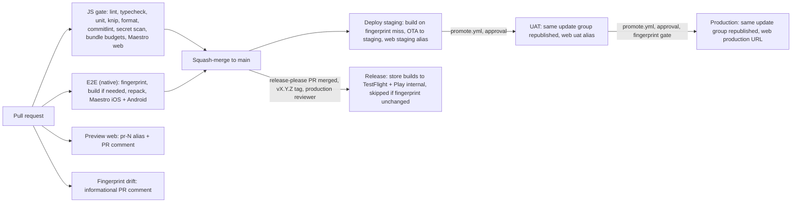

## The pipeline

[CI overview](ci-overview.md) is the legend for this picture: every job and workflow, what
triggers it, what it needs, and where to look when one is red. The
[release ladder](release-ladder.md) is the runbook from a merge to the stores.
